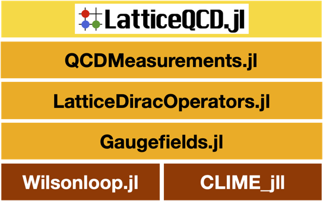

# Gaugefields

[](https://github.com/akio-tomiya/Gaugefields.jl/actions/workflows/CI.yml)
[](https://akio-tomiya.github.io//Gaugefields.jl/dev)

# Abstract

This is a package for lattice QCD codes.
Treating gauge fields (links), gauge actions with MPI and autograd.

 

This package will be used in [LatticeQCD.jl](https://github.com/akio-tomiya/LatticeQCD.jl). 

# What this package can do:
This package has following functionarities

- SU(Nc) (Nc > 1) gauge fields in 2 or 4 dimensions with arbitrary actions.
- U(1) gauge fields in 2 dimensions with arbitrary actions. 
- Configuration generation
    - Heatbath
    - quenched Hybrid Monte Carlo
- Gradient flow via RK3
- I/O: ILDG and Bridge++ formats are supported ([c-lime](https://usqcd-software.github.io/c-lime/) will be installed implicitly with [CLIME_jll](https://github.com/JuliaBinaryWrappers/CLIME_jll.jl) )
- MPI parallel computation (experimental. See documents.)

Dynamical fermions will be supported with [LatticeDiracOperators.jl](https://github.com/akio-tomiya/LatticeDiracOperators.jl).

In addition, this supports followings
- **Autograd for functions with SU(Nc) variables**
- Stout smearing (exp projecting smearing)
- Stout force via [backpropagation](https://arxiv.org/abs/2103.11965)

Autograd can be worked for general Wilson lines except for ones have overlaps.

# Install

In Julia REPL in the package mode,
```
add Gaugefields.jl
```

# How to use

## File loading
## ILDG format
[ILDG](https://www-zeuthen.desy.de/~pleiter/ildg/ildg-file-format-1.1.pdf) format is one of standard formats for LatticeQCD configurations.

We can read ILDG format like: 

```julia
NX = 4
NY = 4
NZ = 4
NT = 4
Nwing = 1
Dim = 4

U = Initialize_Gaugefields(NC,Nwing,NX,NY,NZ,NT,condition = "cold")

ildg = ILDG(filename)
i = 1
L = [NX,NY,NZ,NT]
load_gaugefield!(U,i,ildg,L,NC)
```
Then, we can calculate the plaquette: 

```julia
temp1 = similar(U[1])
temp2 = similar(U[1])

comb = 6
factor = 1/(comb*U[1].NV*U[1].NC)
@time plaq_t = calculate_Plaquette(U,temp1,temp2)*factor
println("plaq_t = $plaq_t")
poly = calculate_Polyakov_loop(U,temp1,temp2) 
println("polyakov loop = $(real(poly)) $(imag(poly))")
```

We can write a configuration as the ILDG format like 

```julia
filename = "hoge.ildg"
save_binarydata(U,filename)
```

## Text format for Bridge++
Gaugefields.jl also supports a text format for [Bridge++](https://bridge.kek.jp/Lattice-code/index_e.html). 

### File loading

```julia
filename = "testconf.txt"
load_BridgeText!(filename,U,L,NC)
```

### File saving

```julia
filename = "testconf.txt"
save_textdata(U,filename)
```


## Heatbath updates (even-odd method)

```julia
using Gaugefields


function heatbath_SU3!(U,NC,temps,β)
    Dim = 4
    temp1 = temps[1]
    temp2 = temps[2]
    V = temps[3]
    ITERATION_MAX = 10^5

    temps2 = Array{Matrix{ComplexF64},1}(undef,5) 
    temps3 = Array{Matrix{ComplexF64},1}(undef,5) 
    for i=1:5
        temps2[i] = zeros(ComplexF64,2,2)
        temps3[i] = zeros(ComplexF64,NC,NC)
    end


    mapfunc!(A,B) = SU3update_matrix!(A,B,β,NC,temps2,temps3,ITERATION_MAX)

    for μ=1:Dim

        loops = loops_staple[(Dim,μ)]
        iseven = true

        evaluate_gaugelinks_evenodd!(V,loops,U,[temp1,temp2],iseven)
        map_U!(U[μ],mapfunc!,V,iseven) 

        iseven = false
        evaluate_gaugelinks_evenodd!(V,loops,U,[temp1,temp2],iseven)
        map_U!(U[μ],mapfunc!,V,iseven) 
    end
    
end

function heatbathtest_4D(NX,NY,NZ,NT,β,NC)
    Dim = 4
    Nwing = 1

    U = Initialize_Gaugefields(NC,Nwing,NX,NY,NZ,NT,condition = "cold")

    temp1 = similar(U[1])
    temp2 = similar(U[1])
    temp3 = similar(U[1])

    comb = 6
    factor = 1/(comb*U[1].NV*U[1].NC)
    @time plaq_t = calculate_Plaquette(U,temp1,temp2)*factor
    println("plaq_t = $plaq_t")
    poly = calculate_Polyakov_loop(U,temp1,temp2) 
    println("polyakov loop = $(real(poly)) $(imag(poly))")

    numhb = 40
    for itrj = 1:numhb
        heatbath_SU3!(U,NC,[temp1,temp2,temp3],β)

        if itrj % 10 == 0
            @time plaq_t = calculate_Plaquette(U,temp1,temp2)*factor
            println("$itrj plaq_t = $plaq_t")
            poly = calculate_Polyakov_loop(U,temp1,temp2) 
            println("$itrj polyakov loop = $(real(poly)) $(imag(poly))")
        end
    end
    

    return plaq_t

end

NX = 4
NY = 4
NZ = 4
NT = 4
Nwing = 1

β = 5.7
NC = 3
@time plaq_t = heatbathtest_4D(NX,NY,NZ,NT,β,NC)
```

## Heatbath updates with general actions
We can do heatbath updates with a general action.

```julia
using Gaugefields

function heatbathtest_4D(NX,NY,NZ,NT,β,NC)
    Dim = 4
    Nwing = 1

    U = Initialize_Gaugefields(NC,Nwing,NX,NY,NZ,NT,condition = "cold")
    println(typeof(U))

    gauge_action = GaugeAction(U)
    plaqloop = make_loops_fromname("plaquette",Dim=Dim)
    append!(plaqloop,plaqloop')
    βinp = β/2
    push!(gauge_action,βinp,plaqloop)

    rectloop = make_loops_fromname("rectangular",Dim=Dim)
    append!(rectloop,rectloop')
    βinp = β/2
    push!(gauge_action,βinp,rectloop)

    hnew = Heatbath_update(U,gauge_action)

    show(gauge_action)

    temp1 = similar(U[1])
    temp2 = similar(U[1])
    temp3 = similar(U[1])

    comb = 6
    factor = 1/(comb*U[1].NV*U[1].NC)
    @time plaq_t = calculate_Plaquette(U,temp1,temp2)*factor
    println("plaq_t = $plaq_t")
    poly = calculate_Polyakov_loop(U,temp1,temp2) 
    println("polyakov loop = $(real(poly)) $(imag(poly))")

    numhb = 1000
    for itrj = 1:numhb

        heatbath!(U,hnew)

        plaq_t = calculate_Plaquette(U,temp1,temp2)*factor
        poly = calculate_Polyakov_loop(U,temp1,temp2) 

        if itrj % 40 == 0
            println("$itrj plaq_t = $plaq_t")
            println("$itrj polyakov loop = $(real(poly)) $(imag(poly))")
        end
    end
    
    close(fp)
    return plaq_t

end

NX = 4
NY = 4
NZ = 4
NT = 4
NC = 3
β = 5.7
heatbathtest_4D(NX,NY,NZ,NT,β,NC)
```

In this code, we consider the plaquette and rectangular actions. 

## Gradient flow
We can use Lüscher's gradient flow.

```julia
NX = 4
NY = 4
NZ = 4
NT = 4
Nwing = 1
NC = 3

U = Initialize_Gaugefields(NC,Nwing,NX,NY,NZ,NT,condition = "hot")

temp1 = similar(U[1])
temp2 = similar(U[1])
temp3 = similar(U[1])

comb = 6
factor = 1/(comb*U[1].NV*U[1].NC)

g = Gradientflow(U)
for itrj=1:100
    flow!(U,g)
    @time plaq_t = calculate_Plaquette(U,temp1,temp2)*factor
    println("$itrj plaq_t = $plaq_t")
    poly = calculate_Polyakov_loop(U,temp1,temp2) 
    println("$itrj polyakov loop = $(real(poly)) $(imag(poly))")
end

```

## Gradient flow with general terms
We can do the gradient flow with general terms with the use of Wilsonloop.jl, which is shown below.
The coefficient of the action can be complex. The complex conjugate of the action defined here is added automatically to make the total action hermitian.   
The code is 

```julia

using Random
using Test
using Gaugefields
using Wilsonloop

function gradientflow_test_4D(NX,NY,NZ,NT,NC)
    Dim = 4
    Nwing = 1

    Random.seed!(123)

    U = Initialize_Gaugefields(NC,Nwing,NX,NY,NZ,NT,condition = "hot",randomnumber="Reproducible")

    temp1 = similar(U[1])
    temp2 = similar(U[1])

    if Dim == 4
        comb = 6 #4*3/2
    elseif Dim == 3
        comb = 3
    elseif Dim == 2
        comb = 1
    else
        error("dimension $Dim is not supported")
    end
    factor = 1/(comb*U[1].NV*U[1].NC)


    @time plaq_t = calculate_Plaquette(U,temp1,temp2)*factor
    println("0 plaq_t = $plaq_t")
    poly = calculate_Polyakov_loop(U,temp1,temp2) 
    println("0 polyakov loop = $(real(poly)) $(imag(poly))")

    #Plaquette term
    loops_p = Wilsonline{Dim}[]
    for μ=1:Dim
        for ν=μ:Dim
            if ν == μ
                continue
            end
            loop1 = Wilsonline([(μ,1),(ν,1),(μ,-1),(ν,-1)],Dim = Dim)
            push!(loops_p,loop1)
        end
    end

    #Rectangular term
    loops = Wilsonline{Dim}[]
    for μ=1:Dim
        for ν=μ:Dim
            if ν == μ
                continue
            end
            loop1 = Wilsonline([(μ,1),(ν,2),(μ,-1),(ν,-2)],Dim = Dim)
            push!(loops,loop1)
            loop1 = Wilsonline([(μ,2),(ν,1),(μ,-2),(ν,-1)],Dim = Dim)
            
            push!(loops,loop1)
        end
    end

    listloops = [loops_p,loops]
    listvalues = [1+im,0.1]
    g = Gradientflow_general(U,listloops,listvalues,eps = 0.01)

    for itrj=1:100
        flow!(U,g)
        if itrj % 10 == 0
            @time plaq_t = calculate_Plaquette(U,temp1,temp2)*factor
            println("$itrj plaq_t = $plaq_t")
            poly = calculate_Polyakov_loop(U,temp1,temp2) 
            println("$itrj polyakov loop = $(real(poly)) $(imag(poly))")
        end
    end
    return plaq_t

end


function gradientflow_test_2D(NX,NT,NC)
    Dim = 2
    Nwing = 1
    U = Initialize_Gaugefields(NC,Nwing,NX,NT,condition = "hot",randomnumber="Reproducible")

    temp1 = similar(U[1])
    temp2 = similar(U[1])

    if Dim == 4
        comb = 6 #4*3/2
    elseif Dim == 3
        comb = 3
    elseif Dim == 2
        comb = 1
    else
        error("dimension $Dim is not supported")
    end

    factor = 1/(comb*U[1].NV*U[1].NC)

    @time plaq_t = calculate_Plaquette(U,temp1,temp2)*factor
    println("0 plaq_t = $plaq_t")
    poly = calculate_Polyakov_loop(U,temp1,temp2) 
    println("0 polyakov loop = $(real(poly)) $(imag(poly))")

    #g = Gradientflow(U,eps = 0.01)
    #listnames = ["plaquette"]
    #listvalues = [1]
    loops_p = Wilsonline{Dim}[]
    for μ=1:Dim
        for ν=μ:Dim
            if ν == μ
                continue
            end

            loop1 = Wilsonline([(μ,1),(ν,1),(μ,-1),(ν,-1)],Dim = Dim)
            push!(loops_p,loop1)

        end
    end


    loops = Wilsonline{Dim}[]
    for μ=1:Dim
        for ν=μ:Dim
            if ν == μ
                continue
            end
            loop1 = Wilsonline([(μ,1),(ν,2),(μ,-1),(ν,-2)],Dim = Dim)
            push!(loops,loop1)
            loop1 = Wilsonline([(μ,2),(ν,1),(μ,-2),(ν,-1)],Dim = Dim)
            
            push!(loops,loop1)
        end
    end

    listloops = [loops_p,loops]
    listvalues = [1+im,0.1]
    g = Gradientflow_general(U,listloops,listvalues,eps = 0.01)

    for itrj=1:100
        flow!(U,g)
        if itrj % 10 == 0
            @time plaq_t = calculate_Plaquette(U,temp1,temp2)*factor
            println("$itrj plaq_t = $plaq_t")
            poly = calculate_Polyakov_loop(U,temp1,temp2) 
            println("$itrj polyakov loop = $(real(poly)) $(imag(poly))")
        end
    end

    return plaq_t

end


const eps = 0.1


println("2D system")
@testset "2D" begin
    NX = 4
    #NY = 4
    #NZ = 4
    NT = 4
    Nwing = 1

    @testset "NC=1" begin
        β = 2.3
        NC = 1
        println("NC = $NC")
        @time plaq_t = gradientflow_test_2D(NX,NT,NC)
    end
    #error("d")
    
    @testset "NC=2" begin
        β = 2.3
        NC = 2
        println("NC = $NC")
        @time plaq_t = gradientflow_test_2D(NX,NT,NC)
    end

    @testset "NC=3" begin
        β = 5.7
        NC = 3
        println("NC = $NC")
        @time plaq_t = gradientflow_test_2D(NX,NT,NC)
    end

    @testset "NC=4" begin
        β = 5.7
        NC = 4
        println("NC = $NC")
        @time plaq_t = gradientflow_test_2D(NX,NT,NC)
    end
end

println("4D system")
@testset "4D" begin
    NX = 4
    NY = 4
    NZ = 4
    NT = 4
    Nwing = 1


    
    @testset "NC=2" begin
        β = 2.3
        NC = 2
        println("NC = $NC")
        @time plaq_t = gradientflow_test_4D(NX,NY,NZ,NT,NC)
    end

    @testset "NC=3" begin
        β = 5.7
        NC = 3
        println("NC = $NC")
        @time plaq_t = gradientflow_test_4D(NX,NY,NZ,NT,NC)
    end

    @testset "NC=4" begin
        β = 5.7
        NC = 4
        println("NC = $NC")

        val = 0.7301232810349298
        @time plaq_t =gradientflow_test_4D(NX,NY,NZ,NT,NC)
    end


end
```

# Utilities

## Data structure
We can access the gauge field defined on the bond between two neigbohr points. 
In 4D system, the gauge field is like ```u[ic,jc,ix,iy,iz,it]```. 
There are four directions in 4D system. Gaugefields.jl uses the array like: 

```julia
NX = 4
NY = 4
NZ = 4
NT = 4
Nwing = 1
Dim = 4

U = Initialize_Gaugefields(NC,Nwing,NX,NY,NZ,NT,condition = "cold")

```

In the later exaples, we use, ``mu=1`` and ``u=U[mu]`` as an example.

## Hermitian conjugate (Adjoint operator)
If you want to get the hermitian conjugate of the gauge fields, you can do like 

```julia
u'
```

This is evaluated with the lazy evaluation. 
So there is no memory copy. 
This returms $U_\mu^dagger$ for all sites.

## Shift operator
If you want to shift the gauge fields, you can do like 

```julia
shifted_u = shift_U(u, shift)
```
This is also evaluated with the lazy evaluation. 
Here ``shift`` is ``shift=(1,0,0,0)`` for example.

## matrix-field matrix-field product
If you want to calculate the matrix-matrix multiplicaetion on each lattice site, you can do like

As a mathematical expression, for matrix-valued fields ``A(n), B(n)``,
we define "matrix-field matrix-field product" as,


for all site index n.

In our package, this is expressed as,

```julia
mul!(C,A,B)
```
which means ```C = A*B``` on each lattice site. 
Here ``A, B, C`` are same type of ``u``.

## Trace operation 
If you want to calculate the trace of the gauge field, you can do like 

```julia
tr(A)
```
It is useful to evaluation actions. 
This trace operation summing up all indecis, spacetime and color.

# Applications

This package and Wilsonloop.jl enable you to perform several calcurations.
Here we demonstrate them.

Some of them will be simplified in LatticeQCD.jl.

## Wilson loops
We develop [Wilsonloop.jl](https://github.com/akio-tomiya/Wilsonloop.jl.git), which is useful to calculate Wilson loops. 
If you want to use this, please install like

```
add Wilsonloop.jl
```

For example, if you want to calculate the following quantity: 

```math
U_{1}(n)U_{2}(n+\hat{1}) U^{\dagger}_{1}(n+\hat{2}) U^{\dagger}_2(n)
```

You can use Wilsonloop.jl as follows

```julia
using Wilsonloop
loop = [(1,1),(2,1),(1,-1),(2,-1)]
w = Wilsonline(loop)
```
The output is ```L"$U_{1}(n)U_{2}(n+e_{1})U^{\dagger}_{1}(n+e_{2})U^{\dagger}_{2}(n)$"```. 
Then, you can evaluate this loop with the use of the Gaugefields.jl like: 

```julia
using LinearAlgebra
NX = 4
NY = 4
NZ = 4
NT = 4
NC = 3
Nwing = 1
Dim = 4
U = Initialize_Gaugefields(NC,Nwing,NX,NY,NZ,NT,condition = "cold")

temp1 = similar(U[1])
V = similar(U[1])

evaluate_gaugelinks!(V,w,U,[temp1])
println(tr(V))
```

For example, if you want to calculate the clover operators, you can define like: 

```julia
function make_cloverloop(μ,ν,Dim)
    loops = Wilsonline{Dim}[]
    loop_righttop = Wilsonline([(μ,1),(ν,1),(μ,-1),(ν,-1)],Dim = Dim) # Pmunu
    push!(loops,loop_righttop)
    loop_rightbottom = Wilsonline([(ν,-1),(μ,1),(ν,1),(μ,-1)],Dim = Dim) # Qmunu
    push!(loops,loop_rightbottom)
    loop_leftbottom= Wilsonline([(μ,-1),(ν,-1),(μ,1),(ν,1)],Dim = Dim) # Rmunu
    push!(loops,loop_leftbottom)
    loop_lefttop = Wilsonline([(ν,1),(μ,-1),(ν,-1),(μ,1)],Dim = Dim) # Smunu
    push!(loops,loop_lefttop)
    return loops
end
```

The energy density defined in the paper (Ramos and Sint, [Eur. Phys. J. C (2016) 76:15](https://link.springer.com/article/10.1140%2Fepjc%2Fs10052-015-3831-9)) can be calculated as follows.  Note: the coefficient in the equation (3.40) in the preprint version is wrong. 

```julia
function make_clover(G,U,temps,Dim)
    temp1 = temps[1]
    temp2 = temps[2]
    temp3 = temps[3]
    
    for μ=1:Dim
        for ν=1:Dim
            if μ == ν
                continue
            end
            loops = make_cloverloop(μ,ν,Dim)
            evaluate_gaugelinks!(temp3,loops,U,[temp1,temp2])

            Traceless_antihermitian!(G[μ,ν],temp3)
        end
    end
end

function calc_energydensity(G,U,temps,Dim)
    temp1 = temps[1]
    s = 0
    for μ=1:Dim
        for ν=1:Dim
            if μ == ν
                continue
            end
            mul!(temp1,G[μ,ν],G[μ,ν])
            s += -real(tr(temp1))/2
        end
    end
    return  s/(4^2*U[1].NV)
end
```

Then, we can calculate the energy density: 

```julia
function test(NX,NY,NZ,NT,β,NC)
    Dim = 4
    Nwing = 1

    U = Initialize_Gaugefields(NC,Nwing,NX,NY,NZ,NT,condition = "cold")

    filename = "./conf_00000010.txt" 
    L = [NX,NY,NZ,NT]
    load_BridgeText!(filename,U,L,NC) # We load a configuration from a file. 

    temp1 = similar(U[1])
    temp2 = similar(U[1])
    temp3 = similar(U[1])

    println("Make clover operator")
    G = Array{typeof(u1),2}(undef,Dim,Dim)
    for μ=1:Dim
        for ν=1:Dim
            G[μ,ν] = similar(U[1])
        end
    end

    comb = 6
    factor = 1/(comb*U[1].NV*U[1].NC)
    @time plaq_t = calculate_Plaquette(U,temp1,temp2)*factor
    println("plaq_t = $plaq_t")

    g = Gradientflow(U,eps = 0.01)
    for itrj=1:100
        flow!(U,g)

        make_clover(G,U,[temp1,temp2,temp3],Dim)
        E = calc_energydensity(G,U,[temp1,temp2,temp3],Dim)

        plaq_t = calculate_Plaquette(U,temp1,temp2)*factor
        println("$itrj $(itrj*0.01) plaq_t = $plaq_t , E = $E")
    end

end
NX = 8
NY = 8
NZ = 8
NT = 8
β = 5.7
NC = 3
test(NX,NY,NZ,NT,β,NC)
```


## Calculating actions
We can calculate actions from this packages with fixed gauge fields U. 
We introduce the concenpt "Scalar-valued neural network", which is S(U) -> V, where U and V are gauge fields. 


```julia
using Gaugefields
using LinearAlgebra
function test1()
    NX = 4
    NY = 4
    NZ = 4
    NT = 4
    Nwing = 1
    Dim = 4
    NC = 3

    U  =Initialize_Gaugefields(NC,Nwing,NX,NY,NZ,NT,condition = "cold")


    gauge_action = GaugeAction(U) #empty network
    plaqloop = make_loops_fromname("plaquette") #This is a plaquette loops. 
    append!(plaqloop,plaqloop') #We need hermitian conjugate loops for making the action real. 
    β = 1 #This is a coefficient.
    push!(gauge_action,β,plaqloop)
    
    show(gauge_action)

    Uout = evaluate_Gaugeaction_untraced(gauge_action,U)
    println(tr(Uout))
end

test1()
```

The output is 

```
----------------------------------------------
Structure of the actions for Gaugefields
num. of terms: 1
-------------------------------
      1-st term: 
          coefficient: 1.0
      -------------------------
1-st loop
L"$U_{1}(n)U_{2}(n+e_{1})U^{\dagger}_{1}(n+e_{2})U^{\dagger}_{2}(n)$"	
2-nd loop
L"$U_{1}(n)U_{3}(n+e_{1})U^{\dagger}_{1}(n+e_{3})U^{\dagger}_{3}(n)$"	
3-rd loop
L"$U_{1}(n)U_{4}(n+e_{1})U^{\dagger}_{1}(n+e_{4})U^{\dagger}_{4}(n)$"	
4-th loop
L"$U_{2}(n)U_{3}(n+e_{2})U^{\dagger}_{2}(n+e_{3})U^{\dagger}_{3}(n)$"	
5-th loop
L"$U_{2}(n)U_{4}(n+e_{2})U^{\dagger}_{2}(n+e_{4})U^{\dagger}_{4}(n)$"	
6-th loop
L"$U_{3}(n)U_{4}(n+e_{3})U^{\dagger}_{3}(n+e_{4})U^{\dagger}_{4}(n)$"	
7-th loop
L"$U_{2}(n)U_{1}(n+e_{2})U^{\dagger}_{2}(n+e_{1})U^{\dagger}_{1}(n)$"	
8-th loop
L"$U_{3}(n)U_{1}(n+e_{3})U^{\dagger}_{3}(n+e_{1})U^{\dagger}_{1}(n)$"	
9-th loop
L"$U_{4}(n)U_{1}(n+e_{4})U^{\dagger}_{4}(n+e_{1})U^{\dagger}_{1}(n)$"	
10-th loop
L"$U_{3}(n)U_{2}(n+e_{3})U^{\dagger}_{3}(n+e_{2})U^{\dagger}_{2}(n)$"	
11-th loop
L"$U_{4}(n)U_{2}(n+e_{4})U^{\dagger}_{4}(n+e_{2})U^{\dagger}_{2}(n)$"	
12-th loop
L"$U_{4}(n)U_{3}(n+e_{4})U^{\dagger}_{4}(n+e_{3})U^{\dagger}_{3}(n)$"	
      -------------------------
----------------------------------------------
9216.0 + 0.0im

```

# How to calculate derivatives
We can easily calculate the matrix derivative of the actions. The matrix derivative is defined as 


We can calculate this like 

```julia
dSdUμ = calc_dSdUμ(gauge_action,μ,U)
```

or

```julia
calc_dSdUμ!(dSdUμ,gauge_action,μ,U)
```
## Hybrid Monte Carlo
With the use of the matrix derivative, we can do the Hybrid Monte Carlo method. 
The simple code is as follows. 

```julia
using Gaugefields
using LinearAlgebra

function MDtest!(gauge_action,U,Dim)
    p = initialize_TA_Gaugefields(U) #This is a traceless-antihermitian gauge fields. This has NC^2-1 real coefficients. 
    Uold = similar(U)
    substitute_U!(Uold,U)
    MDsteps = 100
    temp1 = similar(U[1])
    temp2 = similar(U[1])
    comb = 6
    factor = 1/(comb*U[1].NV*U[1].NC)
    numaccepted = 0

    numtrj = 100
    for itrj = 1:numtrj
        accepted = MDstep!(gauge_action,U,p,MDsteps,Dim,Uold)
        numaccepted += ifelse(accepted,1,0)

        plaq_t = calculate_Plaquette(U,temp1,temp2)*factor
        println("$itrj plaq_t = $plaq_t")
        println("acceptance ratio ",numaccepted/itrj)
    end
end
```

We define the functions as 

```julia

function calc_action(gauge_action,U,p)
    NC = U[1].NC
    Sg = -evaluate_GaugeAction(gauge_action,U)/NC #evaluate_GaugeAction(gauge_action,U) = tr(evaluate_Gaugeaction_untraced(gauge_action,U))
    Sp = p*p/2
    S = Sp + Sg
    return real(S)
end

function MDstep!(gauge_action,U,p,MDsteps,Dim,Uold)
    Δτ = 1/MDsteps
    gauss_distribution!(p)
    Sold = calc_action(gauge_action,U,p)
    substitute_U!(Uold,U)

    for itrj=1:MDsteps
        U_update!(U,p,0.5,Δτ,Dim,gauge_action)

        P_update!(U,p,1.0,Δτ,Dim,gauge_action)

        U_update!(U,p,0.5,Δτ,Dim,gauge_action)
    end
    Snew = calc_action(gauge_action,U,p)
    println("Sold = $Sold, Snew = $Snew")
    println("Snew - Sold = $(Snew-Sold)")
    ratio = min(1,exp(Snew-Sold))
    if rand() > ratio
        substitute_U!(U,Uold)
        return false
    else
        return true
    end
end

function U_update!(U,p,ϵ,Δτ,Dim,gauge_action)
    temps = get_temporary_gaugefields(gauge_action)
    temp1 = temps[1]
    temp2 = temps[2]
    expU = temps[3]
    W = temps[4]

    for μ=1:Dim
        exptU!(expU,ϵ*Δτ,p[μ],[temp1,temp2])
        mul!(W,expU,U[μ])
        substitute_U!(U[μ],W)
        
    end
end

function P_update!(U,p,ϵ,Δτ,Dim,gauge_action) # p -> p +factor*U*dSdUμ
    NC = U[1].NC
    temps = get_temporary_gaugefields(gauge_action)
    dSdUμ = temps[end]
    factor =  -ϵ*Δτ/(NC)

    for μ=1:Dim
        calc_dSdUμ!(dSdUμ,gauge_action,μ,U)
        mul!(temps[1],U[μ],dSdUμ) # U*dSdUμ
        Traceless_antihermitian_add!(p[μ],factor,temps[1])
    end
end
```

Then, we can do the HMC: 

```julia
function test1()
    NX = 4
    NY = 4
    NZ = 4
    NT = 4
    Nwing = 1
    Dim = 4
    NC = 3

    U  =Initialize_Gaugefields(NC,Nwing,NX,NY,NZ,NT,condition = "cold")


    gauge_action = GaugeAction(U)
    plaqloop = make_loops_fromname("plaquette")
    append!(plaqloop,plaqloop') # add hermitian conjugate
    β = 5.7/2 # real part; re[p] = (p+p')/2
    push!(gauge_action,β,plaqloop)
    
    show(gauge_action)

    MDtest!(gauge_action,U,Dim)

end


test1()
```

## Stout smearing
We can use stout smearing. 


The smearing is regarded as gauge covariant neural networks [Tomiya and Nagai, arXiv:2103.11965](https://arxiv.org/abs/2103.11965). 
The network is constructed as follows. 

```julia
    nn = CovNeuralnet()
    ρ = [0.1]
    layername = ["plaquette"]
    st = STOUT_Layer(layername,ρ,L)
    push!(nn,st)

    show(nn)
```

The output is 

```
num. of layers: 1
- 1-st layer: STOUT
num. of terms: 1
-------------------------------
      1-st term: 
          coefficient: 0.1
      -------------------------
1-st loop
L"$U_{1}(n)U_{2}(n+e_{1})U^{\dagger}_{1}(n+e_{2})U^{\dagger}_{2}(n)$"	
2-nd loop
L"$U_{1}(n)U_{3}(n+e_{1})U^{\dagger}_{1}(n+e_{3})U^{\dagger}_{3}(n)$"	
3-rd loop
L"$U_{1}(n)U_{4}(n+e_{1})U^{\dagger}_{1}(n+e_{4})U^{\dagger}_{4}(n)$"	
4-th loop
L"$U_{2}(n)U_{3}(n+e_{2})U^{\dagger}_{2}(n+e_{3})U^{\dagger}_{3}(n)$"	
5-th loop
L"$U_{2}(n)U_{4}(n+e_{2})U^{\dagger}_{2}(n+e_{4})U^{\dagger}_{4}(n)$"	
6-th loop
L"$U_{3}(n)U_{4}(n+e_{3})U^{\dagger}_{3}(n+e_{4})U^{\dagger}_{4}(n)$"	
      -------------------------
```

Since we ragard the smearing as the neural networks, we can calculate the derivative with the use of the back propergation techques. 


For example, 

```julia
using Gaugefields
using Wilsonloop

function stoutsmearing(NX,NY,NZ,NT,NC)
    Nwing = 1
    Dim = 4
    U = Initialize_Gaugefields(NC,Nwing,NX,NY,NZ,NT,condition = "hot")
    L = [NX,NY,NZ,NT]

    comb = 6
    factor = 1/(comb*U[1].NV*U[1].NC)
    temp1 = similar(U[1])
    temp2 = similar(U[1])
    plaq_t = calculate_Plaquette(U,temp1,temp2)*factor
    println(" plaq_t = $plaq_t")


    nn = CovNeuralnet()
    ρ = [0.1]
    layername = ["plaquette"]
    st = STOUT_Layer(layername,ρ,L)
    push!(nn,st)

    show(nn)

    
    @time Uout,Uout_multi,_ = calc_smearedU(U,nn)
    plaq_t = calculate_Plaquette(Uout,temp1,temp2)*factor
    println("plaq_t = $plaq_t")


    gauge_action = GaugeAction(U)
    plaqloop = make_loops_fromname("plaquette")
    append!(plaqloop,plaqloop')# add hermitian conjugate
    β = 5.7/2 # real part; re[p] = (p+p')/2
    push!(gauge_action,β,plaqloop)

    μ = 1
    dSdUμ = similar(U)
    for μ=1:Dim
        dSdUμ[μ] = calc_dSdUμ(gauge_action,μ,U)
    end

    @time dSdUbareμ = back_prop(dSdUμ,nn,Uout_multi,U) 

end

NX = 4
NY = 4
NZ = 4
NT = 4
NC = 3
stoutsmearing(NX,NY,NZ,NT,NC)
```

# HMC with stout smearing
With the use of the derivatives, we can do the HMC with the stout smearing. 
The code is shown as follows

```julia
using Gaugefields
using LinearAlgebra

function MDtest!(gauge_action,U,Dim,nn)
    p = initialize_TA_Gaugefields(U) #This is a traceless-antihermitian gauge fields. This has NC^2-1 real coefficients. 
    Uold = similar(U)
    dSdU = similar(U)
    
    substitute_U!(Uold,U)
    MDsteps = 100
    temp1 = similar(U[1])
    temp2 = similar(U[1])
    comb = 6
    factor = 1/(comb*U[1].NV*U[1].NC)
    numaccepted = 0
    

    numtrj = 100
    for itrj = 1:numtrj
        accepted = MDstep!(gauge_action,U,p,MDsteps,Dim,Uold,nn,dSdU)
        numaccepted += ifelse(accepted,1,0)

        plaq_t = calculate_Plaquette(U,temp1,temp2)*factor
        println("$itrj plaq_t = $plaq_t")
        println("acceptance ratio ",numaccepted/itrj)
    end
end

function calc_action(gauge_action,U,p)
    NC = U[1].NC
    Sg = -evaluate_GaugeAction(gauge_action,U)/NC #evaluate_GaugeAction(gauge_action,U) = tr(evaluate_GaugeAction_untraced(gauge_action,U))
    Sp = p*p/2
    S = Sp + Sg
    return real(S)
end


function MDstep!(gauge_action,U,p,MDsteps,Dim,Uold,nn,dSdU)
    

    Δτ = 1/MDsteps
    gauss_distribution!(p)

    Uout,Uout_multi,_ = calc_smearedU(U,nn)
    Sold = calc_action(gauge_action,Uout,p)

    substitute_U!(Uold,U)

    for itrj=1:MDsteps
        U_update!(U,p,0.5,Δτ,Dim,gauge_action)

        P_update!(U,p,1.0,Δτ,Dim,gauge_action,dSdU,nn)

        U_update!(U,p,0.5,Δτ,Dim,gauge_action)
    end

    Uout,Uout_multi,_ = calc_smearedU(U,nn)
    Snew = calc_action(gauge_action,Uout,p)

    println("Sold = $Sold, Snew = $Snew")
    println("Snew - Sold = $(Snew-Sold)")

    accept = exp(Sold - Snew) >= rand()

    if accept != true #rand() > ratio
        substitute_U!(U,Uold)
        return false
    else
        return true
    end

end

function U_update!(U,p,ϵ,Δτ,Dim,gauge_action)
    temps = get_temporary_gaugefields(gauge_action)
    temp1 = temps[1]
    temp2 = temps[2]
    expU = temps[3]
    W = temps[4]

    for μ=1:Dim
        exptU!(expU,ϵ*Δτ,p[μ],[temp1,temp2])
        mul!(W,expU,U[μ])
        substitute_U!(U[μ],W)
        
    end
end

function P_update!(U,p,ϵ,Δτ,Dim,gauge_action,dSdU,nn) # p -> p +factor*U*dSdUμ
    NC = U[1].NC
    factor =  -ϵ*Δτ/(NC)
    temps = get_temporary_gaugefields(gauge_action)
    Uout,Uout_multi,_ = calc_smearedU(U,nn)

    for μ=1:Dim
        calc_dSdUμ!(dSdU[μ],gauge_action,μ,Uout)
    end

    dSdUbare = back_prop(dSdU,nn,Uout_multi,U) 
    
    for μ=1:Dim
        mul!(temps[1],U[μ],dSdUbare[μ]) # U*dSdUμ
        Traceless_antihermitian_add!(p[μ],factor,temps[1])
    end
end

function test1()
    NX = 4
    NY = 4
    NZ = 4
    NT = 4
    Nwing = 1
    Dim = 4
    NC = 3

    U  =Initialize_Gaugefields(NC,Nwing,NX,NY,NZ,NT,condition = "hot")


    gauge_action = GaugeAction(U)
    plaqloop = make_loops_fromname("plaquette")
    append!(plaqloop,plaqloop')
    β = 5.7/2
    push!(gauge_action,β,plaqloop)

    show(gauge_action)

    L = [NX,NY,NZ,NT]
    nn = CovNeuralnet()
    ρ = [0.1]
    layername = ["plaquette"]
    st = STOUT_Layer(layername,ρ,L)
    push!(nn,st)

    

    MDtest!(gauge_action,U,Dim,nn)

end


test1()
```


