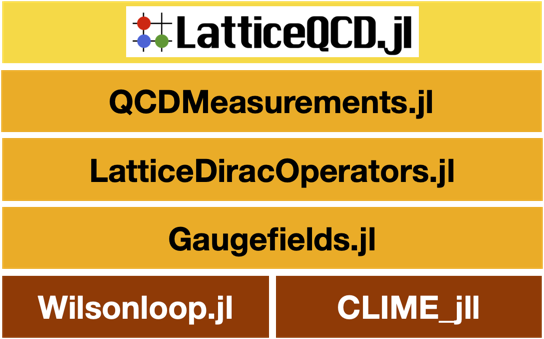

# Gaugefields

[](https://github.com/akio-tomiya/Gaugefields.jl/actions/workflows/CI.yml)
[](https://akio-tomiya.github.io/Gaugefields.jl/v1/)

🎉 **Gaugefields.jl v1.0.1 is available!** This patch release makes
Enzyme-backed molecular dynamics compatible with Julia 1.12 while preserving
the v1 API and Julia 1.11 compatibility.

Gaugefields.jl reached its first stable major release with v1.0.0.

## What's fixed in v1.0.1

- Enzyme MD differentiates the underlying LatticeMatrices links directly,
  avoiding Julia 1.12 failures involving composite gauge-field and lazy
  shifted/adjoint wrappers.
- `mul_shifted!`, `mul_shifted_adjoint!`, and `mul_adjoint!` provide clear,
  Enzyme-safe lattice-product operations for custom potentials.
- The Enzyme guide now includes the Julia 1.12-compatible potential contract
  and complete plaquette/HMC examples.

## What's new in v1.0.0

Compared with the previous release, v0.7.3, v1.0.0 adds and stabilizes:

- **A new high-level API** centered on `gauge_configuration`. It returns a
  vector of `Dim` gauge-link fields, uses the LatticeMatrices backend by
  default, and has a default halo width of one.
- **Portable 2D, 3D, and 4D execution** with
  [LatticeMatrices.jl](https://github.com/cometscome/LatticeMatrices.jl) v1.1
  and [JACC.jl](https://github.com/JuliaORNL/JACC.jl), covering threaded CPUs,
  NVIDIA, AMD, and Intel GPUs, MPI domain decomposition, and multi-GPU jobs.
- **Portable update and analysis workflows**, including plaquette and general
  Wilson-loop actions, heatbath and overrelaxation, gradient flow, 4D stout
  smearing, special initial configurations, and configuration I/O.
- **Decomposition-independent random-number streams** for seeded LM hot
  starts, Gaussian momenta, and heatbath updates, with explicit seeds and
  sweep counters for reproducible simulations.
- **A deterministic molecular-dynamics driver** with `QPQ()`, `PQP()`, and
  user-defined integrators, plus optional Enzyme-based action derivatives.
- **A reorganized v1 manual** with four-dimensional examples first, dedicated
  MPI/GPU, randomness, HMC, Enzyme, and Wilson-action guides, and the complete
  historical interface collected on one Legacy API page.

**Upgrading from v0.7:** Existing programs using `Initialize_Gaugefields` and
the historical API remain supported and retain their legacy backend and
defaults. New programs should use `gauge_configuration`, whose default backend
is LatticeMatrices. Gaugefields v1 requires LatticeMatrices v1.1 or later;
Enzyme users must add `Enzyme` as a direct dependency. See the
[high-level API](docs/src/highlevelapi.md) and
[Legacy API migration map](docs/src/legacyapi.md#migration-map).

# Abstract

This is a package for lattice QCD codes.
Treating gauge fields (links), gauge actions with MPI and autograd.

 

This package is used in [LatticeQCD.jl](https://github.com/akio-tomiya/LatticeQCD.jl)
and a code in a project [JuliaQCD](https://github.com/JuliaQCD/).

[NOTE: This is an extended version in order to implement higher-form gauge fields
 (i.e., 't Hooft twisted boundary condition/flux).
See [o-morikawa/Gaugefields.jl](https://github.com/o-morikawa/Gaugefields.jl)]

If you have questions and comments. Please use the issues section of this repository or use [Discussions in JuliaQCD](https://github.com/orgs/JuliaQCD/discussions/4).

[In Japanese] 質問やコメントを日本語でしたい方は[JuliaQCDのディスカッションボード](https://github.com/orgs/JuliaQCD/discussions/3)に書き込みをしてください。
 
# What this package can do:
This package has following functionarities

- SU(Nc) (Nc > 1) gauge fields in 2, 3, or 4 dimensions with arbitrary actions.
- **Z(Nc) 2-form gauge fields in 4 dimensions, which are given as 't Hooft flux.**
- U(1) gauge fields in 2 dimensions with arbitrary actions. 
- Configuration generation
    - Heatbath
    - quenched Hybrid Monte Carlo
    - quenched Hybrid Monte Carlo being subject to 't Hooft twisted b.c.
        - with external (non-dynamical) Z(Nc) 2-form gauge fields
    - quenched Hybrid Monte Carlo for SU(Nc)/Z(Nc) gauge theory
        - with dynamical Z(Nc) 2-form gauge fields
- Gradient flow via RK3
    - Yang-Mills gradient flow
    - Yang-Mills gradient flow being subject to 't Hooft twisted b.c.
    - Gradient flow for SU(Nc)/Z(Nc) gauge theory
- I/O: ILDG and Bridge++ formats are supported ([c-lime](https://usqcd-software.github.io/c-lime/) will be installed implicitly with [CLIME_jll](https://github.com/JuliaBinaryWrappers/CLIME_jll.jl) )
- MPI parallel computation (experimental. See documents.)
    - quenched HMC with MPI being subject to 't Hooft twisted b.c.

- Portable GPU and multi-GPU computation through
  [LatticeMatrices.jl](https://github.com/cometscome/LatticeMatrices.jl) v1.1.0
  and [JACC.jl](https://github.com/JuliaORNL/JACC.jl). See the
  [GPU and multi-GPU tutorial](docs/src/tutorial4d.md#multiple-gpus-with-mpi).
    - NVIDIA GPUs through CUDA.jl
    - AMD GPUs through AMDGPU.jl/ROCm
    - Intel GPUs through oneAPI.jl
    - MPI domain decomposition with automatic node-local rank-to-device mapping

**The implementation of higher-form gauge fields is based on
[arXiv:2303.10977 [hep-lat]](https://arxiv.org/abs/2303.10977).**

Dynamical fermions will be supported with [LatticeDiracOperators.jl](https://github.com/akio-tomiya/LatticeDiracOperators.jl).

In addition, this supports followings
- **Autograd for functions with SU(Nc) variables**
- Stout smearing (exp projecting smearing)
- Stout force via [backpropagation](https://arxiv.org/abs/2103.11965)
- LLVM-level Automatic differentiation with [Enzyme.jl](https://github.com/EnzymeAD/Enzyme.jl) (above 0.7. Experimental)

Autograd can be worked for general Wilson lines except for ones have overlaps.

# Install

In Julia REPL in the package mode,
```
add Gaugefields JACC
```

Add `MPI` as a direct dependency for MPI applications. JACC installs or
selects the package required by the requested GPU backend.

# How to use

## Recommended high-level API

The high-level API creates a vector with one gauge link field for each lattice
direction. It uses the LatticeMatrices/JACC backend by default:

```julia
import JACC
JACC.@init_backend

using Gaugefields

U = gauge_configuration(
    (16, 16, 16, 32);
    colors=3,
    start=:hot,
    seed=1234,
    process_grid=(1, 1, 1, 1),
    eltype=ComplexF64,
)

@assert length(U) == 4
@assert gauge_halo_width(U) == 1
println("plaquette = ", measure_plaquette(U))
println("Polyakov loop = ", measure_polyakov_loop(U))
```

Use `backend=LegacyBackend()` to request the serial compatibility backend.
The existing `Initialize_Gaugefields` API and its legacy default remain
unchanged.

Gaugefields also provides a deterministic, preallocated MD driver. `QPQ()` is
the default; `PQP()` and custom integrators are supported:

```julia
action = GaugeAction(U)
plaquettes = make_loops_fromname("plaquette", Dim=4)
append!(plaquettes, plaquettes')
push!(action, 6.0 / 2, plaquettes)
p = gaussian_momenta(U; seed=3000, sweep=0)

md = md_driver(
    U,
    action;
    steps=20,
    trajectory_length=1.0,
    integrator=QPQ(),
)
result = md_trajectory!(U, p, md)
```

Momentum refresh and HMC accept/reject policy remain the responsibility of a
higher-level package or application.

## Documentation

The manual contains the complete v1 API description and task-oriented examples:

- [Four-dimensional quick start](docs/src/tutorial4d.md)
- [Wilson loops and gauge actions](docs/src/wilsonloops_actions.md)
- [Measurements and QCDMeasurements.jl](docs/src/measurements.md)
- [HMC and custom integrators](docs/src/hmc.md)
- [Automatic differentiation with Enzyme](docs/src/autodiff.md)
- [Two- and three-dimensional fields](docs/src/dimensions.md)
- [Randomness and reproducibility](docs/src/randomness.md)
- [High-level API parameters](docs/src/highlevelapi.md)
- [MPI, GPU, and multi-GPU execution](docs/src/tutorial4d.md#multiple-gpus-with-mpi)

The APIs and examples that appeared in earlier versions of this README remain
available for compatibility. Their complete documentation has moved to the
single [Legacy API](docs/src/legacyapi.md) page. New code should use the
high-level v1 API above.

# Acknowledgment
If you write a paper using this package, please refer this code.

BibTeX citation is following
```
@article{Nagai:2024yaf,
    author = "Nagai, Yuki and Tomiya, Akio",
    title = "{JuliaQCD: Portable lattice QCD package in Julia language}",
    eprint = "2409.03030",
    archivePrefix = "arXiv",
    primaryClass = "hep-lat",
    month = "9",
    year = "2024"
}
```
and the paper is [arXiv:2409.03030](https://arxiv.org/abs/2409.03030).
