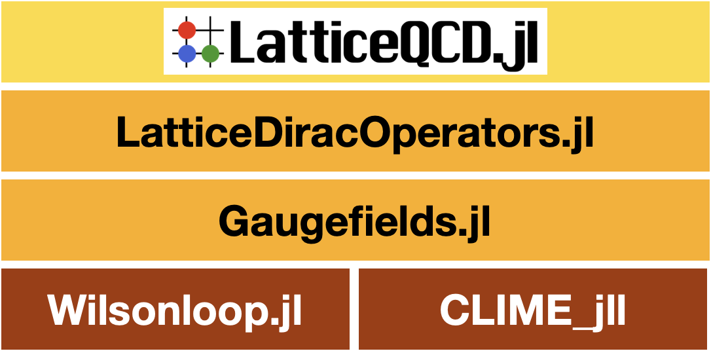

# Gaugefields


Documentation for [Gaugefields](https://github.com/akio-tomiya/Gaugefields.jl).

```@index
```


[](https://github.com/akio-tomiya/Gaugefields.jl/actions/workflows/CI.yml)

# Abstract

This is a package for lattice QCD codes.
Treating gauge fields (links), gauge actions with MPI and autograd.


```@raw html

```


This package will be used in [LatticeQCD.jl](https://github.com/akio-tomiya/LatticeQCD.jl). 

# What this package can do:
This package has following functionarities

- SU(Nc) (Nc > 1) gauge fields in 2, 3, or 4 dimensions with arbitrary actions.
- U(1) gauge fields in 2 dimensions with arbitrary actions. 
- Configuration generation
    - Heatbath
    - quenched Hybrid Monte Carlo
- Gradient flow via RK3
- I/O: ILDG and Bridge++ formats are supported ([c-lime](https://usqcd-software.github.io/c-lime/) will be installed implicitly with [CLIME_jll](https://github.com/JuliaBinaryWrappers/CLIME_jll.jl) )
- MPI parallel computation (experimental. not shown)

Dynamical fermions will be supported with [LatticeDiracOperators.jl](https://github.com/akio-tomiya/LatticeDiracOperators.jl).

In addition, this supports followings
- **Autograd for functions with SU(Nc) variables**
- Stout smearing (exp projecting smearing)
- Stout force via [backpropagation](https://arxiv.org/abs/2103.11965)

Autograd can be worked for general Wilson lines except for ones have overlaps.

# Install

```
add Gaugefields
```

Start with the [four-dimensional quick start](tutorial4d.md). Gaugefields v1
uses the LatticeMatrices/JACC backend by default; shorter examples for
[two and three dimensions](dimensions.md) use the same API.

Existing programs that use `Initialize_Gaugefields`, constructor backend flags,
or the earlier low-level HMC routines remain supported. Their documentation is
collected on the single [Legacy API (compatibility)](legacyapi.md) page; new
applications should use the v1 high-level API.


